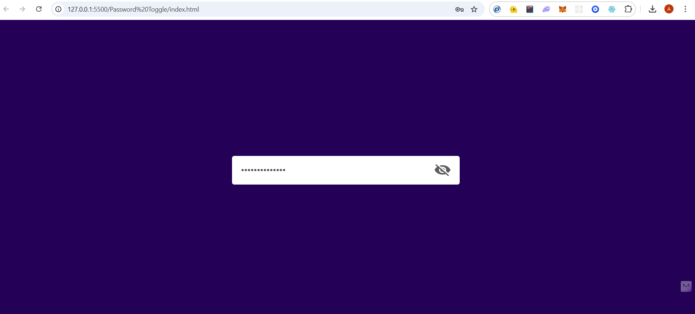
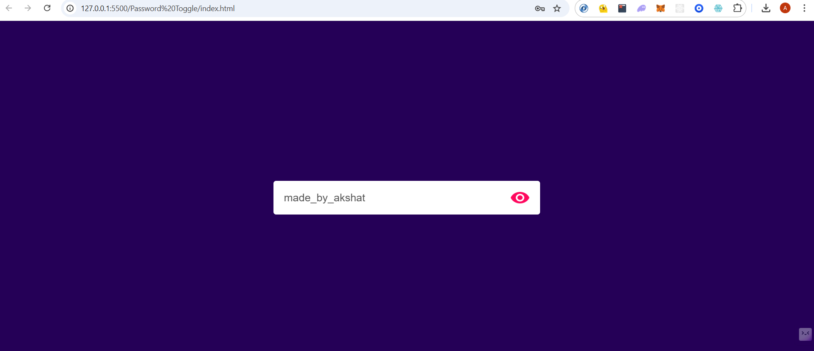

# Overview

One of the mini mini projects in my Javascript mastery series. Basic password hiding and showing off by clicking on eye icon.

# Project Screenshots

## Password Hidden (Before click)

## Password Shown (After Click)

