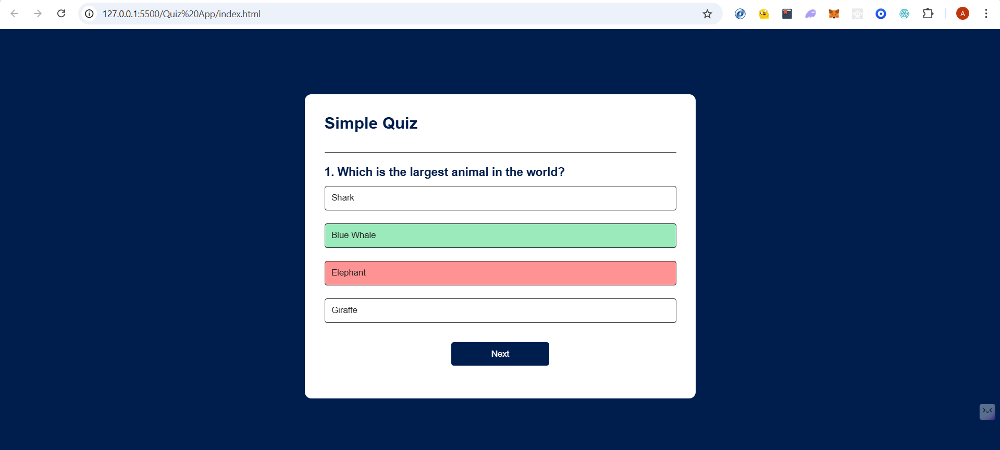
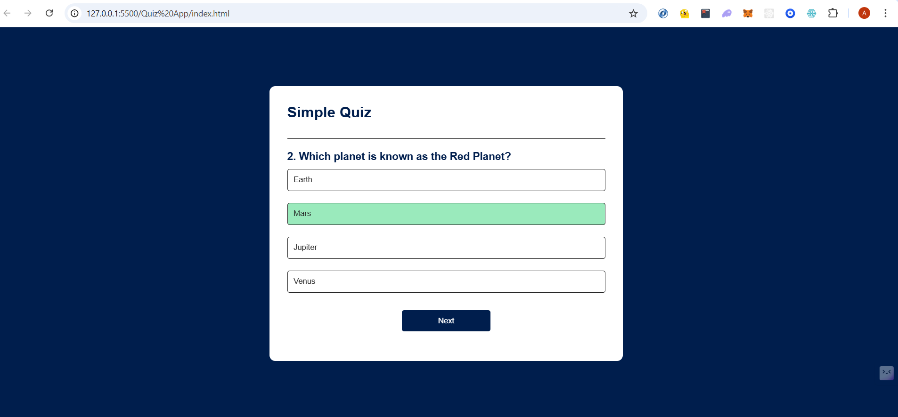
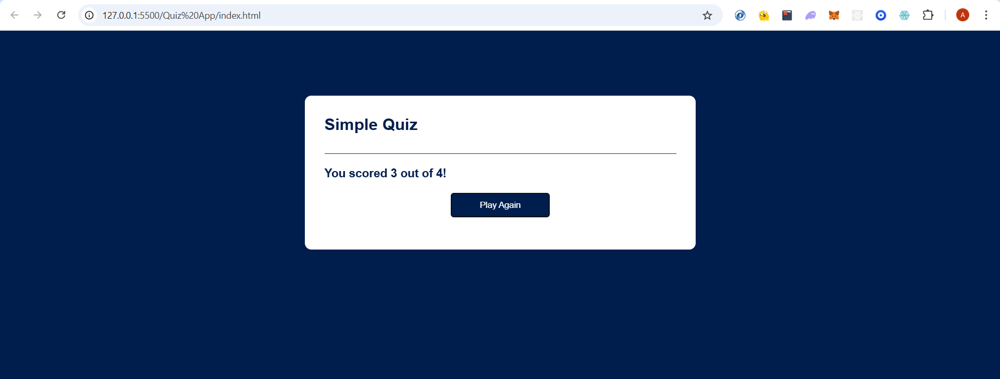

# Quiz App Project

One of the mini projects in my Javascript mastery series. Basic Quiz app which has 4 hardcoded questions(we can also use OpenAI API to generate more random questions but thats an overextension to this project, for now I am going to keep it simple).

# Project Screenshots

## If you select wrong answer

## If you select right answer

## Final Score looks like this

